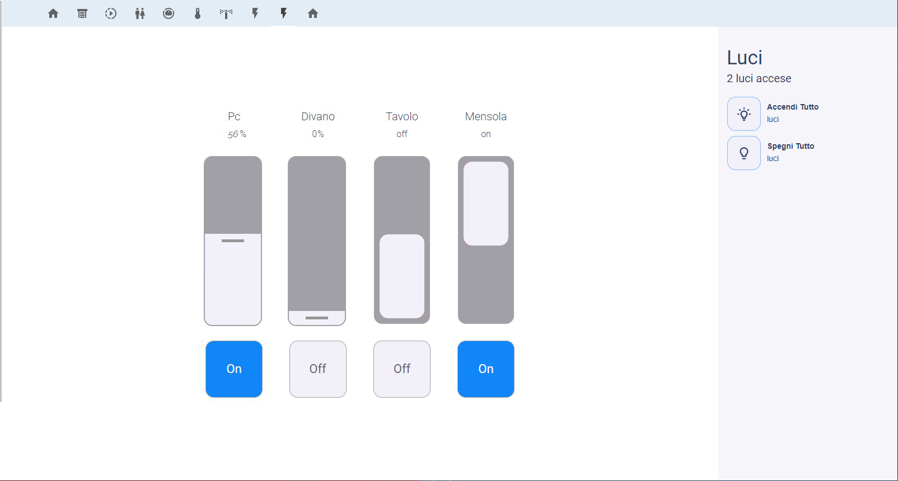

# NOTE: need in "your-theme.yaml"
```yaml
#button
  active-background-button-color: '#0080ff'
  deactive-background-button-color: "#f2f0fa"
  button-border-standard: rgba(0, 128, 255, .5)
  state-icon-active-color: "#0080ff"
  
 alternatively you can use this theme: [sout ui theme](https://github.com/madmicio/soft-ui-theme)
  
```
# Lights Panel Card



# locelace config example

**panel: true** REQUIRED
 ```yaml
 - title: ''
    panel: true
    background: #ffffff
    path: luci
    icon: 'mdi:flash'
    badges: []
    cards:
      - type: custom:lights-cover-panel-card 
        title: Luci
        icon: mdi:lightbulb-multiple-outline
        entities:
          - entity: light.luce_del_pc
            name: Pc
          - entity: light.luce_del_divano
            name: Divano
          - entity: light.luce_del_tavolo
            name: Tavolo
          - entity: light.luce_mensola
            name: Mensola
          # - entity: light.luce_cucina
        sidebuttons:
            # - entity: null
          - entity: script.script.accendi_luci
            name: Apri Tutto
            label: tapparelle
            icon: 'mdi:lightbulb-on-outline'
            cardtype: script
          - entity: script.script.spegni_luci
            name: Apri Tutto
            label: tapparelle
            icon: 'mdi:lightbulb-outline'
            cardtype: script
```
**NOTE: if you do not need the buttons in the right column of the card you must still enter the following code**
 ```yaml
        sidebuttons:
          - entity: null
```
**Min Config**
 ```yaml
- type: custom:lights-cover-panel-card 
    title: Luci
    icon: mdi:lightbulb-multiple-outline
    entities:
        - entity: light.luce_del_pc
        name: Pc

    sidebuttons:
        - entity: null
```
## hacs install

1. install `lights-cover-panel-card.js` plugin

2. Add a reference to `lights-cover-panel-card.js` inside your `ui-lovelace.yaml` or at the top of the *raw config editor UI*:

  ```yaml
resources:
  - type: module
    url: /hacsfiles/lights-cover-panel-card/lights-cover-panel-card.js
```

## Install

### Manual install

1. Download and copy `lights-cover-panel-card.js` from (https://github.com/madmicio/lights-cover-panel-card) into your `config/www`  directory.

2. Add a reference to `shutter-cover-panel-card.js` inside your `ui-lovelace.yaml` or at the top of the *raw config editor UI*:

  ```yaml
  resources:
    - url: /local/lights-cover-panel-card
      type: module
  ```

### Main Options
| Name | Type | Default | Supported options | Description |
| -------------- | ----------- | ------------ | ------------------------------------------------ | --------------------------------------------------------------------------------------------------------------------------------------------------------------------------------------------------------------------------------------------------------------------------------------------------------------------------------------------- |
| `type` | string | **Required** | `custom:shutter-cover-panel-card` | Type of the card |
| `entities` | string | **Required** | entity | list of entitity |
| `innershadow` |  | enable | enable/disable | enable - disable innershadow in the card |
| `iconemboss` |  | enable | enable/disable | enable - disable icon emboss effect |
| `lightrcolor` |  | "#f2f0fa" | your color | define the cover color |
| `lightbackground` |  | "#a1a0a6" | your color | define the background cover color and up-stop-downbuttos background color |
| `background` |  | tranpsarent | your color | define the background card color |
| `brightnessWidth` |  | 100px |  | define the dimmer light columns width |
| `brightnessHeight` |  | 300px |  | define the dimmer light columns height |
| `switchWidth` |  | 100px |  | define the switch light columns width |
| `switchHeight` |  | 300px |  | define the switch light columns height |
| `title` |  | string |  | card title  |
| `countText` |  | aperte |  | text after numer of turn on lights |
| `borderradius` |  | 15px |  | cover border-radius value |
| `buttonborderradius` |  | 15px |  | buttons border-radius value |
| `lightdistance` |  | 150px |  | set distance between lights |
| `sidebackground` |  | "#f6f5fa" |  | set sidebar background |

### entity Options
| Name | Type | Default | Supported options | Description |
| -------------- | ----------- | ------------ | ------------------------------------------------ | --------------------------------------------------------------------------------------------------------------------------------------------------------------------------------------------------------------------------------------------------------------------------------------------------------------------------------------------- |
| `entities` | string | **required** | entity | entity_id |
| `name` | string | optional | string | Define the name of the cover or automatically it takes the friendly name |

### side buttons Options
| Name | Type | Default | Supported options | Description |
| -------------- | ----------- | ------------ | ------------------------------------------------ | --------------------------------------------------------------------------------------------------------------------------------------------------------------------------------------------------------------------------------------------------------------------------------------------------------------------------------------------- |
| `entity` | string | **require** | entity  | entity_id |
| `name` | string | optional | string | Define the name of the button |
| `icon` | string | optional | `mdi:icon` | Icon to display. Will be overriden by the icon defined in a state |
| `type` | string | **Required** | script / button | define the card style and function. in script mode it doesn't change appearance, just click effect , in button mode the icon becomes a button to activate / deactivate the entity ||
